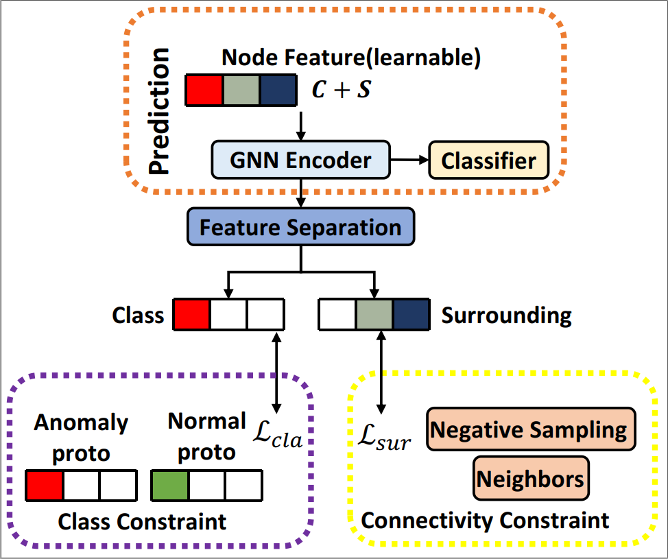

# GDN: Alleviating Structrual Distribution Shift in Graph Anomaly Detection
Pytorch Implementation of

Alleviating Structrual Distribution Shift in Graph Anomaly Detection (WSDM 2023)

# Overview
This work solves the SDS problem from a feature view. We observe that the heterophily degree is different across the training and test environments in GAD, leading to the poor generalization of the classifier. To address the issue, we propose GDN to resist high heterophily for anomalies meanwhile benefit the learning of normals from
homophily. Since different labels correspond to the difference of critical anomaly features which make great contributions to the GAD, we tease out the anomaly features on which we constrain to mitigate the effect of heterophilous neighbors and make them invariant. To better estimate the prior distribution of anomaly features, we devise a prototype vector to infer and update this distribution during training. For normal nodes, we constrain the remaining features to preserve the connectivity of nodes and reinforce the influence of the homophilous neighborhood.

<h2 align="center">
<figure> </figure>
</h2>

Illustration of GDN. The feature separation module
separates the node feature into two sets. Two constraints
are leveraged to assist separation. Blank positions in node
representation mean they are zero when calculating losses.

# Dataset
YelpChi and Amazon can be downloaded from [here](https://github.com/YingtongDou/CARE-GNN/tree/master/data) or [dgl.data.FraudDataset](https://docs.dgl.ai/api/python/dgl.data.html#fraud-dataset).

Run `python src/data_process.py` to pre-process the data.

# Dependencies
Please set up the environment following Requirements in this [repository](https://github.com/PonderLY/PC-GNN). 
```sh
argparse          1.1.0
networkx          1.11
numpy             1.16.4
scikit_learn      0.21rc2
scipy             1.2.1
torch             1.4.0
```

# Reproduce
```sh
python main.py --config ./config/gdn_yelpchi.yml
```

# Acknowledgement
Our code references:
- [CAREGNN](https://github.com/YingtongDou/CARE-GNN)

- [PCGNN](https://github.com/PonderLY/PC-GNN)

# Reference 
```
@inproceedings{
    gao2023gdn,
    title={Alleviating Structrual Distribution Shift in Graph Anomaly Detection},
    author={Yuan Gao and Xiang Wang and Xiangnan He and Zhenguang Liu and Huamin Feng and Yongdong Zhang},
    booktitle={WSDM},
    year={2023},
}
```
